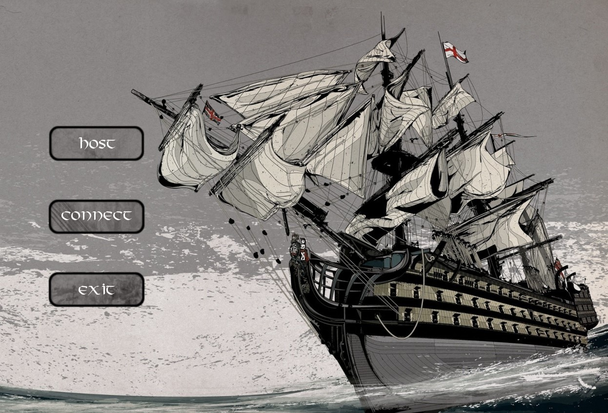
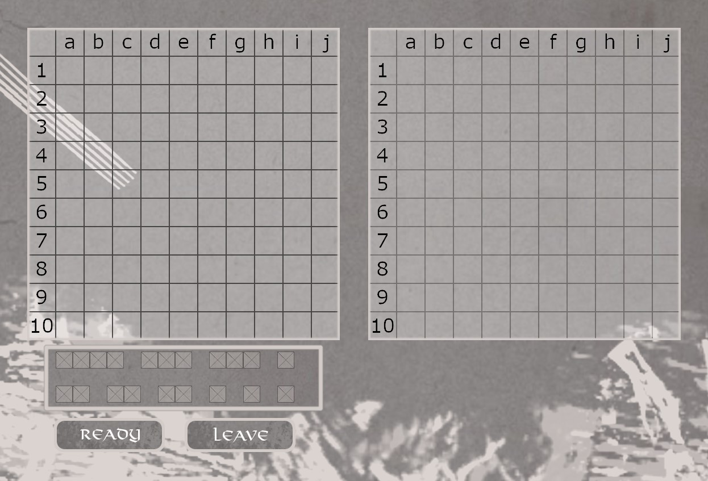
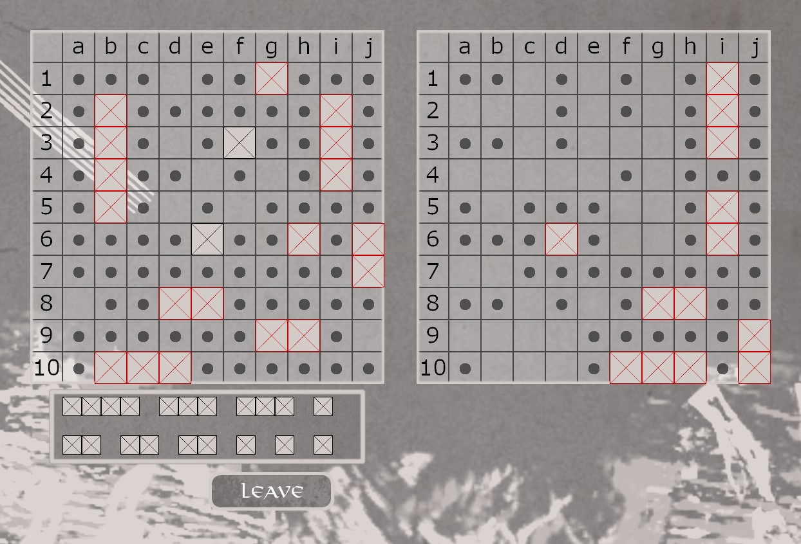
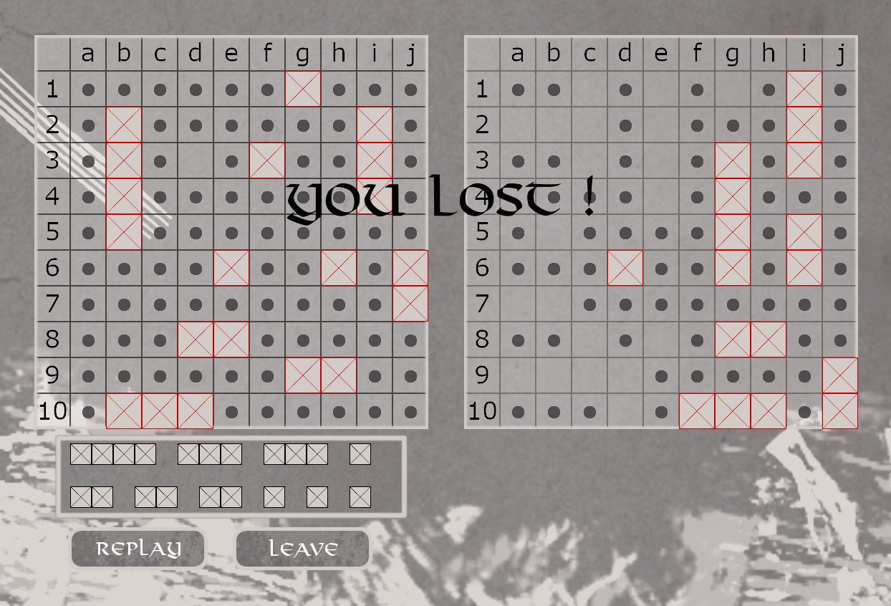

Authors
=============

Pawel Mlynarz: https://github.com/09pawel0898  
Rafal Maziejuk: https://github.com/rafalmaziejuk  

Battleships
=============

A Battleships game written in C++/SFML.
Game can be played only through LAN connection.

Compiling
-----------

You need:
* SFML 2.5.1
* C++17 compliant compiler

If you are using Visual Studio 2019 you can simply run generate_project.bat script
and everything will be ready for compiling and running.

How to play
-----------------

You can launch two clients of our game on your computer.
One will be host (Host option) and the other will be client (Connect option).
In IP input box put for example "127.0.0.1" and in Port input box "20".
It shouldn't matter what you write in Port input box as long as 
it's the same in both clients.

After successfuly entering a match you can put your ships
on to the left grid by clicking left mouse button and dragging your mouse.
If you want to delete one of the ships click right mouse button on it.
When you are ready press "Ready" button and wait for your enemy to do the same,
then the match will begin.

When it's your turn you can choose on the second grid where you want to shoot your
enemy. If you hit one of your enemy's ship then it's still your turn, otherwise
turn goes to the other player.

Screenshots
------------------------

